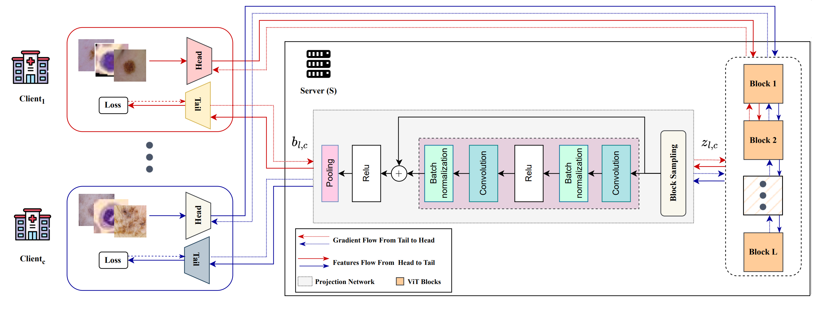

# FeSViBS
Source code for MICCAI 2023 paper entitled: 'FeSViBS: Federated Split Learning of Vision Transformer with Block Sampling'

## Abstract
Data scarcity is a significant obstacle hindering the learning of powerful machine learning models in critical healthcare applications. Data-sharing mechanisms among multiple entities (e.g., hospitals) can accelerate model training and yield more accurate predictions. Recently, approaches such as Federated Learning (FL) and Split Learning (SL) have facilitated collaboration without the need to exchange private data. In this work, we propose a framework for medical imaging classification tasks called \textbf{Fe}derated \textbf{S}plit learning of \textbf{Vi}sion transformer with \textbf{B}lock \textbf{S}ampling \textbf{(FeSViBS)}. The FeSViBS framework builds upon the existing federated split vision transformer and introduces a \emph{block sampling} module, which leverages intermediate features extracted by the Vision Transformer (ViT) at the server. This is achieved by sampling features (patch tokens) from an intermediate transformer block and distilling their information content into a pseudo class token before passing them back to the client. These pseudo class tokens serve as an effective feature augmentation strategy and enhances the generalizability of the learned model. We demonstrate the utility of our proposed method compared to other SL and FL approaches on three publicly available medical imaging datasets: HAM1000, BloodMNIST, and Fed-ISIC2019, under both IID and non-IID settings.